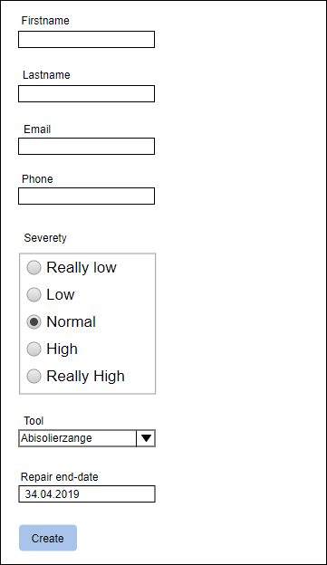
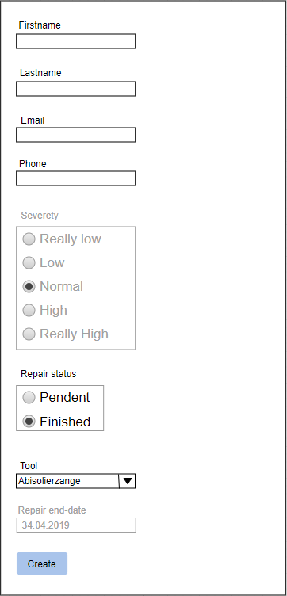

# M307 Projektarbeit (By David Hodel & Simon Müri)

## Konzeptionierung

### Formulare

#### Neue Reparatur erfassen

##### Mockup

##### Datentypen

| Feld                  | Datentyp                          |
|-----------------------|-----------------------------------|
| Vorname               | string                            |
| Nachname              | string                            |
| Email-Adresse         | string                            |
| Telefon               | string                            |
| Dringlichkeit         | Einfach-Auswahl durch Radiobutton |
| Betreffendes Werkzeug | Einfach-Auswahl durch Combobox    |

#### Bestehende Reparatur bearbeiten

##### Mockup

##### Datentypen

| Feld                 | Datentyp                          |
|----------------------|-----------------------------------|
| Vorname              | string                            |
| Nachname             | string                            |
| Email-Adresse        | string                            |
| Telefon              | string                            |
| Status der Reparatur | Einfach-Auswahl durch Radiobutton |
| Werkzeug             | Einfach-Auswahl durch Combobox    |

### Validierung

| Formularfeld        | Validierungen                                  |
|---------------------|------------------------------------------------|
| Vorname             | Required                                       |
| Nachname            | Required                                       |
| Telefon             | Nur Ziffern, Leerzeichen, `+`, `-`, `(`und `)` |
| E-Mail              | Muss ein `@` enthalten                         |
| Dringlichkeit       | Required                                       |
| Werkzeug            | Required                                       |
| Status der Repratur | Required                                       |

### Datenbank

**Tabelle `RepairOrders`**

| Feld-Bezeichnungen | Datentyp      |
|--------------------|---------------|
| Id                 | int           |
| Firstname          | nvarchar(200) |
| Lastname           | nvarchar(200) |
| Phone              | nvarchar(200) |
| Email              | nvarchar(200) |
| Severety           | int           |
| Tool               | int           |
| RepairState        | int           |

**Tabelle `Tools`**

| Feld-Bezeichnungen | Datentyp      |
|--------------------|---------------|
| Id                 | int           |
| ToolName           | nvarchar(200) |

### Testfälle

| Nummer | Gegeben sei                     | Wenn                                                               | Dann                                                                          |
|--------|---------------------------------|--------------------------------------------------------------------|-------------------------------------------------------------------------------|
| 1      | Ich bin auf der Startseite      | ich auf "edit" klicke                                              | öffnet das Edit-Formular                                                      |
| 2      | Ich bin auf der Startseite      | wenn ich auf "new order" klicke                                    | öffnet sich das Create-Formular                                               |
| 3      | Ich bin auf dem Create-Formular | wenn ich den Vornamen und Nachname eingebe und auf "create" klicke | wird das Feld korrekt Validiert                                               |
| 4      | Ich bin auf dem Create-Formular | wenn ich die Telefonnummer eingebe und auf "create" klicke         | wird das Feld korrekt Validiert(Nur Ziffern, Leerzeichen, `+`, `-`, `(`, `)`) |
| 5      | Ich bin auf dem Create-Formular | wenn ich die Email eingebe und auf "create" klicke                 | wird das Feld korrekt Validiert(enthält ein "@")                              |
| 6      | Ich bin auf dem Create-Formular | wenn ich auf dem Formular bin                                      | ist bei Dringlichkeit schon ein Default ausgewählt                            |
| 7      | Ich bin auf der Edit-Formular   | wenn ich auf "edit" klicke                                         | Sollen alle Felder gemäss oben definiert validiert werden                     |
| 8      | Ich bin auf der Startseite      | wenn ich auf "new order" klicke                                    | öffnet sich das Create-Formular                                               |
| 9      | Ich bin auf der Startseite      | wenn ich auf "new order" klicke                                    | öffnet sich das Create-Formular                                               |
| 10     | Ich bin auf der Startseite      | wenn ich auf "new order" klicke                                    | öffnet sich das Create-Formular                                               |

## Testbericht